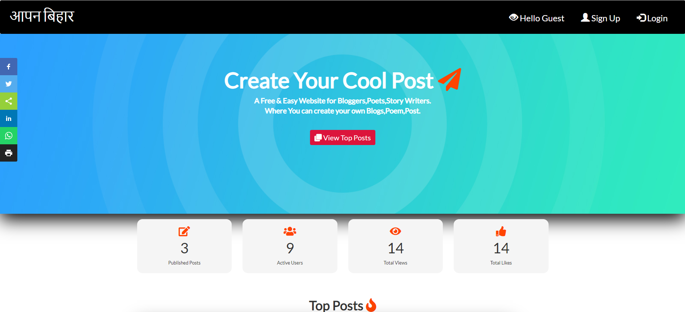
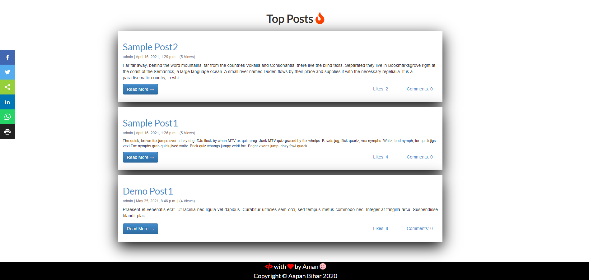
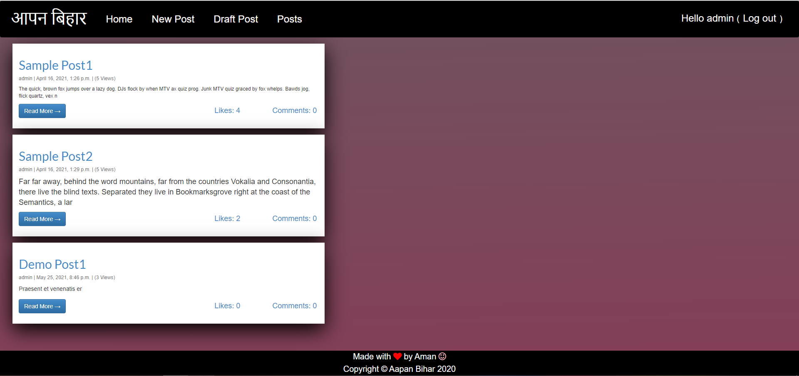
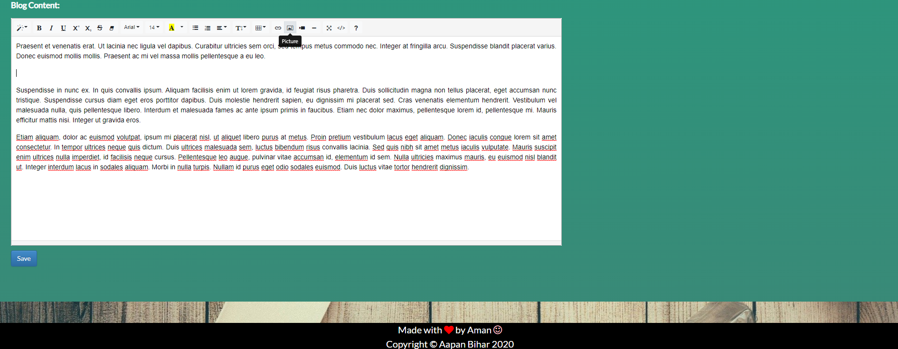
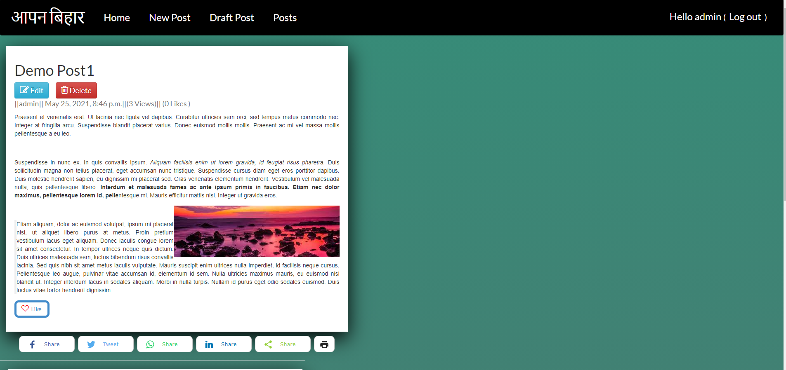
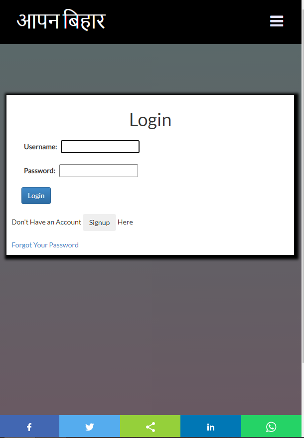
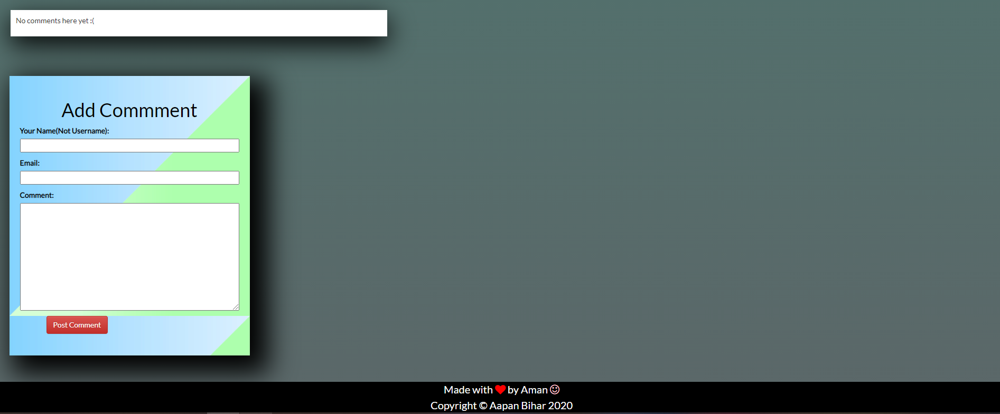

# Blogging Web App

<p align="left">
    <a href="https://github.com/akhil-s-kumar/django-blog-app/issues" alt="Issues">
        </a>
    <a href="https://github.com/akhil-s-kumar/django-blog-app/pulls" alt="Pull Requests">
        </a>
    <a href="https://github.com/akhil-s-kumar/django-blog-app/network/members" alt="Forks">
        </a>
    <a href="https://github.com/akhil-s-kumar/django-blog-app/stargazers" alt="Stars">
        </a>
</p>

This Blogging web application project is purely made with Django as the backend and Bootstrap as the frontend.

## Installation Instructions

If you want to work with this project or create a version of it make sure to follow the steps below!
    Make sure to install ` Python 3 `, ` pip ` and ` virtualenv `  
     
1. Create a project folder
   
    ```bash
        $ mkdir project
        $ cd project
    ```
2. Create a python 3 virtualenv, and activate the environment to install requirements.
    ```bash
        $ python3 -m venv env
        $ source env/bin/activate
    ``` 

3. Clone the repository
   
    ```bash
        (env)$ git clone https://github.com/akhil-s-kumar/django-blog-app.git
        (env)$ cd django-blog-app
    ```

4. Install the project dependencies from `requirements.txt`
    ```
        (env)$ pip install -r requirements.txt
    ```


You have now successfully set up the project on your environment.

## How to run  the project?

Make sure you are in `env` and then do the following each at a time.

```bash
(env)$ python manage.py makemigrations
(env)$ python manage.py makemigrations blogApp
(env)$ python manage.py migrate
(env)$ python manage.py createsuperuser
(env)$ python manage.py runserver
```

## Features

### Blog list View
List all blog posts with Title,Number of total comments, total likes, total views,some body part with Read More button.

### Top Posts
List the top 3 post which are created with Title,Number of total comments, total likes, total views,and some content.

### Pagination
To limit with a certain number of posts in each page.

### Blog Detail View
To view the complete blog post when clicked on Read More or on the Title.


### Login/Register
Users can Login/Register to the Blog App.

### Comment
Users can comment to any blog post comment anonymously without login (moderated).

### Create Blog Post
Users can create blog posts from the front end and add save it as a draft for final publish or preview.


## Tech Stacks

* **Language:**  Python 3.x
* **Framework:** Django 3.1.5

## Latest Fixes

1. Added Django-Summernote , a rich text editor.

## How you can contribute to this project?

1. Fork this project to your GitHub account
2. Clone the repository to your local machine and follow the above Installation instructions.
3. Find an issue or feature and work on it.
4. Make a pull request.

## Screenshots 





